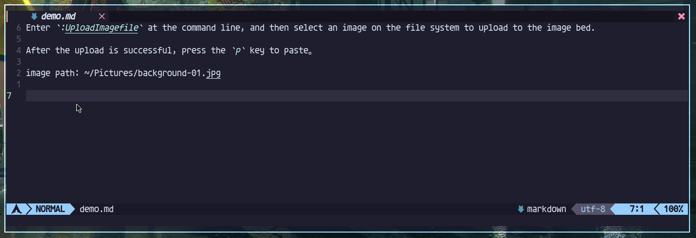

# nvim-picgo
                                         ____  _       ____
                                        |  _ \(_) ___ / ___| ___
                                        | |_) | |/ __| |  _ / _ \
                                        |  __/| | (__| |_| | (_) |
                                        |_|   |_|\___|\____|\___/

                                      · picgo plugin for neovim ·

Fork from **[askfiy/nvim-picgo](https://github.com/askfiy/nvim-picgo)**, refactor the plugin.

**nvim-picgo** is a picture uploading tool based on Lua language. You can quickly upload images to various image beds through it, and it will also generate links in markdown format 🔗. and store it in the clipboard.

In the coc ecosystem, there is a plugin called **[coc-picgo](https://github.com/PLDaily/coc-picgo)** that does the same thing.
The **[coc-picgo](https://github.com/PLDaily/coc-picgo)** plugin is really enviable for those who use nvim's built-in LSP, because we don't need coc，so I created this project and hope it will help you.

## Features

- Written in pure Lua, less than 200 lines of code.
- No default key bindings, I won't take up your precious keys.
- Quickly upload disk files images to the image bed, allowing you to access your images anywhere on the Internet.

## Demo

Upload an image from the file system:



## Dependencies

You need to download **[picgo-core](https://github.com/PicGo/PicGo-Core)**, which is a command line tool.

```
$ npm install picgo -g
```

## Configure picgo image bed

First of all, you need to manually fill in your image bed configuration, and enter:

> Note, not in neovim's cmd mode

```
$ picgo set uploader
? Choose a(n) uploader (Use arrow keys)
  smms
❯ tcyun
  github
  qiniu
  imgur
  aliyun
  upyun
(Move up and down to reveal more choices)
```

Or you can also configure manually:

- Linux and Mac：`~/.config/.picgo/config.json`
- Windows：`C:\Users\youername\.picgo\config.json`

Below is my picgo config file:

```
$ cat $HOME/.picgo/config.json

{
  "picBed": {
    "uploader": "tcyun",
    "current": "tcyun",
    "tcyun": {
      "secretId": "..",
      "secretKey": "..",
      "bucket": "images-1302522496",
      "appId": "1302522496",
      "area": "ap-nanjing",
      "path": "img/",
      "customUrl": "",
      "version": "v5"
    }
  },
  "picgoPlugins": {}
}
```

## Using plugins

It is recommended to use Packer to manage **nvim-picgo**:

``` lua
use {
  "KurisuNya/nvim-picgo",
  config = function()
    -- it doesn't require you to do any configuration
    require("nvim-picgo").setup()
  end
}
```

Default configuration items:

``` lua
{
  -- Whether the generated markdown link saves the upload name of the image
  add_image_name = false,
  -- auto paste next line
  auto_paste = false,
  -- debug output
  debug = false,
}
```

## plugin command

viml：

``` vim
:UploadImagefile<cr>
```

lua：

``` vim
<cmd>lua require'nvim-picgo'.upload_imagefile()<cr>
```

## related resources

- [picgo-core](https://github.com/PicGo/PicGo-Core)
- [coc-picgo](https://github.com/PLDaily/coc-picgo)
- [picgo-doc](https://picgo.github.io/PicGo-Doc/en/guide/)
